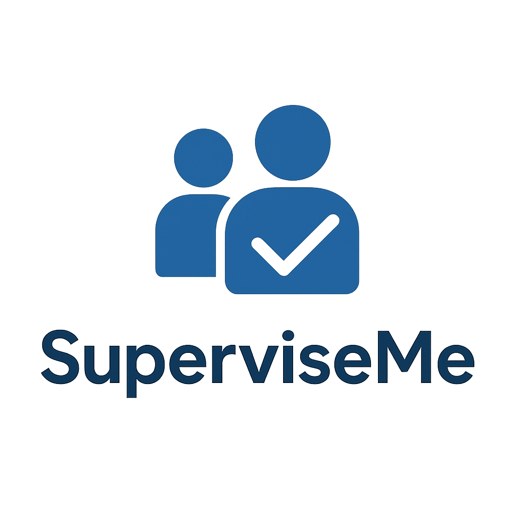

# SuperviseMe

  

Welcome to **SuperviseMe**, a comprehensive platform designed to streamline thesis supervision and research project management within academic institutions. By providing dedicated environments for administrators, supervisors, researchers, and students, SuperviseMe fosters collaboration and simplifies the complexities of academic research management.

## Start Here

If you are new to the project, begin with:

1. [Installation and First Run](installation.md)
2. [Configuration](configuration.md)

## Project Overview

In the dynamic world of academia, managing thesis supervision and research projects can be a daunting task. SuperviseMe addresses this challenge by offering a centralized, Flask-based web application that caters to the distinct needs of all stakeholders. Whether you are an administrator overseeing the entire system, a supervisor guiding students, a researcher collaborating on projects, or a student working on your thesis, SuperviseMe provides the tools you need to succeed.

## Key Features

### Secure and Flexible Authentication

Security is paramount in SuperviseMe. We employ a robust email-based authentication system secured with PBKDF2-SHA256 password hashing. Recognizing the diversity of user preferences, we also support seamless social login integration with Google and ORCID, ensuring that access to your dashboard is both secure and convenient. Our role-based access control system ensures that every user—from administrators to students—sees exactly what they need to see, with appropriate permissions for their specific responsibilities.

### Empowering Administrators

Administrators are the backbone of the SuperviseMe ecosystem. The platform equips them with a powerful dashboard to manage users, monitor system health, and oversee the distribution of theses. With tools for detailed activity monitoring, email notification configuration, and system-wide data export, administrators maintain full control over the platform's operation.

### Supporting Supervisors

SuperviseMe transforms the supervision experience. Supervisors can easily track student progress, provide timely feedback, and share essential resources. The automated weekly email reports ensure that supervisors start their week with a clear summary of their students' activities, while visual indicators help identify students who may need extra support or engagement.

### Facilitating Research

For researchers, SuperviseMe offers a collaborative workspace to manage projects and teams. Researchers can create projects, invite collaborators, and track milestones with ease. The platform supports dual roles, allowing researchers to also act as supervisors when needed, bridging the gap between personal research and academic mentorship.

### Guiding Students

Students benefit from a clear, organized dashboard that keeps their thesis journey on track. From viewing thesis requirements to submitting progress updates and accessing supervisor-provided materials, students have a central hub for all their academic responsibilities.

## Notification System

Communication is key to successful supervision. SuperviseMe integrates a multi-channel notification system to keep everyone in the loop.

**Telegram Integration**: For urgent updates and real-time alerts, users can connect their Telegram accounts to receive instant notifications directly to their devices.

**Weekly Insights**: Our automated email system delivers professional, structured reports every Monday morning, providing supervisors with a digest of student activities and highlighting any areas that require attention.

## Technical Architecture

Built on a solid foundation of modern technologies, SuperviseMe leverages the power of **Flask** for a flexible backend, **SQLAlchemy** for robust database management, and **Bootstrap** for a responsive, user-friendly frontend. The system is designed for reliability and scalability, utilizing **Celery** or **APScheduler** for background tasks and supporting both SQLite and PostgreSQL databases to suit different deployment needs.

## License

SuperviseMe is open-source software licensed under the [GNU General Public License v3.0](https://github.com/GiulioRossetti/SuperviseMe/blob/main/LICENSE).
